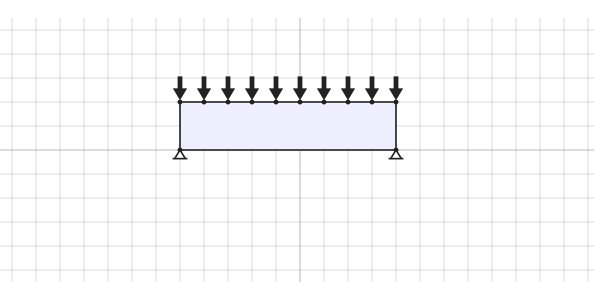
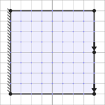

# Examples

## Single span

Below is the contents of a configuration file for a single span example.

```yaml
base_dir: ./ # Base directory where code is being run
output_dir: ./output # Where to save output to
log_level: info # Verbosity used in logging
cores: 2 # Number of cores to use when processing
width: 9 # Width of structure
height: 2 # Height of structure
stress_tensile: 1.0 # Tensile stress
stress_compressive: 1.0 # Compressive stress
joint_cost: 0.0 # Joint costs
loaded_points: # Loaded points
  - [0, 2]
  - [1, 2]
  - [2, 2]
  - [3, 2]
  - [4, 2]
  - [5, 2]
  - [6, 2]
  - [7, 2]
  - [8, 2]
  - [9, 2]
load_direction: # Load direction
  - 0.0
  - -1.0
load_large: 3.75 # Large load
load_small: 0.204 # Small load
max_length: 18.0 # Max length
support_points: # Support points
  - [0, 0]
  - [9, 0]
member_area_filtering: 0.001 # Fraction of maximum member area for output threshold
cvxpy:
  solver: clarabel # See <https://www.cvxpy.org/tutorial/solvers/index.html?h=solve#choosing-a-solver> for further details
filter_levels: [1.0] # List of values to filter by if empty no filtering is performed
primal_method: load_factor # Primal method
problem_name: arch_testing_smaller # Problem name
csv_filename: results.csv # Filename to save results to, if left as `results.csv` will have YYYY-MM-DD-hhmmss added
notes: smaller arch test # Notes to include
plotting:
  run: true # Whether to plot the trusses
  bar_thickness: 0.3 # Bar thickness when plotting
  dpi: 1200 # Dots per inch when plotting
```

The setup of this example is represented by the following image (produced using the
[LayOpt truss layout optimization](https://www.layopt.com/truss/) web tool):


Saving the above configuration as `single_span_config.yaml` in your working directory, you can then run this job with
`layopt -c single_span_config.yaml optimise`.

## Square cantilever

This example is adapted from Subsection 7.2 of [Fairclough et al. (2023)](https://doi.org/10.1007/s00158-023-03585-x).

```yaml
base_dir: ./ # Base directory where code is being run
output_dir: ./output # Where to save output to
log_level: info # Verbosity used in logging
cores: 2 # Number of cores to use when processing
width: 8 # Width of structure
height: 8 # Height of structure
stress_tensile: 1.0 # Tensile stress
stress_compressive: 1.0 # Compressive stress
joint_cost: 0.0 # Joint costs
loaded_points: # Loaded points
  - [8, 0]
  - [8, 4]
load_direction: # Load direction
  - 0.0
  - -1.0
load_large: 50 # Large load
load_small: 5 # Small load
max_length: 16 # Max length
support_points: # Support points
  - [0, 0]
  - [0, 1]
  - [0, 2]
  - [0, 3]
  - [0, 4]
  - [0, 5]
  - [0, 6]
  - [0, 7] 
  - [0, 8]    
member_area_filtering: 0.001 # Fraction of maximum member area for output threshold
cvxpy:
  solver: clarabel # See <https://www.cvxpy.org/tutorial/solvers/index.html?h=solve#choosing-a-solver> for further details
filter_levels: [1.0] # List of values to filter by if empty no filtering is performed
primal_method: load_factor # Primal method
problem_name: square_cantilever # Problem name
csv_filename: results.csv # Filename to save results to, if left as `results.csv` will have YYYY-MM-DD-hhmmss added
notes: square cantilever three load points # Notes to include
plotting:
  run: true # Whether to plot the trusses
  bar_thickness: 0.3 # Bar thickness when plotting
  dpi: 1200 # Dots per inch when plotting
```

The setup of this example is represented by the following image (produced using the
[LayOpt truss layout optimization](https://www.layopt.com/truss/) web tool):


