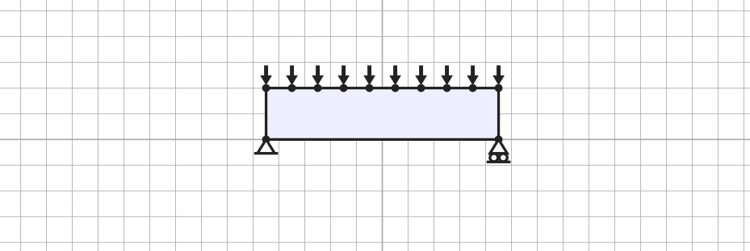
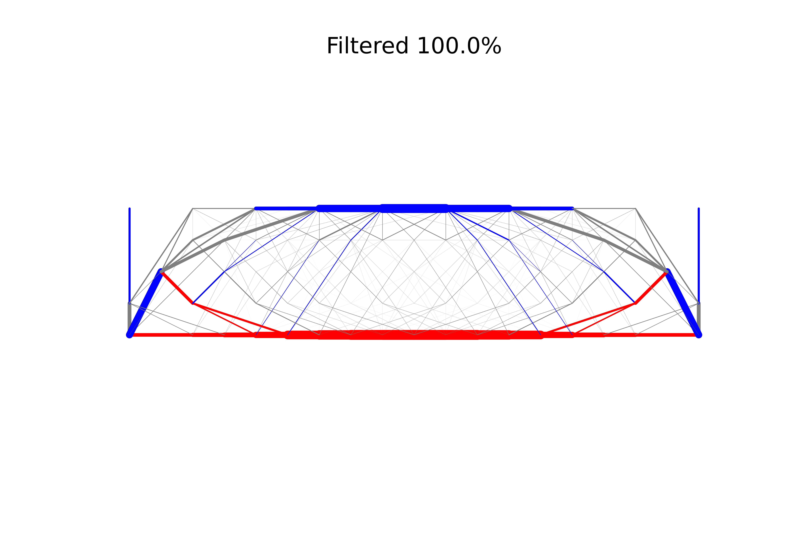
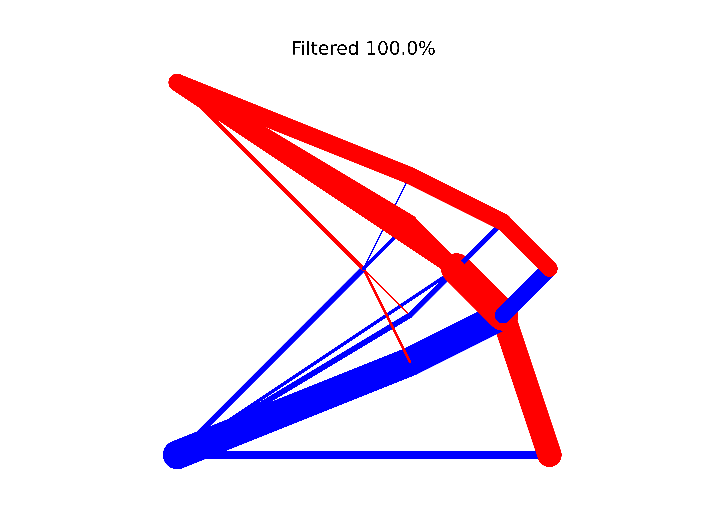

# Examples

## Single span

Below is an example configuration file for a single span structure.

```yaml
base_dir: ./ # Base directory where code is being run
output_dir: ./output # Where to save output to
log_level: info # Verbosity used in logging
cores: 2 # Number of cores to use when processing
width: 18 # Width of structure
height: 4 # Height of structure
steps: 1 # Steps to generate nodes
stress_tensile: 1.0 # Tensile stress
stress_compressive: 1.0 # Compressive stress
joint_cost: 0.0 # Joint costs
loaded_points: # Loaded points
  - [0, 4]
  - [2, 4]
  - [4, 4]
  - [6, 4]
  - [8, 4]
  - [10, 4]
  - [12, 4]
  - [14, 4]
  - [16, 4]
  - [18, 4]
load_direction: # Load direction
  - 0.0
  - -1.0
load_large: 3.75 # Large load
load_small: 0.204 # Small load
max_length: 36 # Max length
max_length_initial_ground_structure: 1.5 # Threshold for marking a potential member as active
support_points: # Support points in form [x_coord, y_coord, restrain_x, restrain_y] (true=fixed, false=free for restrain_x/restrain_y)
  - [0, 0, True, True] # Pinned support
  - [18, 0, False, True] # Roller support
member_area_filtering: 0.001 # Fraction of maximum member area for output threshold
cvxpy:
  solver: clarabel # See <https://www.cvxpy.org/tutorial/solvers/index.html?h=solve#choosing-a-solver> for further details
filter_levels: [1.0] # List of values to filter by if empty no filtering is performed
primal_method: load_factor # Primal method
problem_name: spanning_18x4 # Problem name
csv_filename: results.csv # Filename to save results to, if left as `results.csv` will have YYYY-MM-DD-hhmmss added
notes: spanning 18x4 example four load points # Notes to include
plotting:
  run: true # Whether to plot the trusses
  bar_thickness: 0.3 # Bar thickness when plotting
  dpi: 1200 # Dots per inch when plotting
```

The setup of this example is represented by the following image (produced using the
[LayOpt truss layout optimization](https://www.layopt.com/truss/) web tool):


A copy of the above configuration can be downloaded by right-clicking on
[`single_span_roller_config.yaml`](assets/single_span_roller_config.yaml) and saving it to your working directory (alternatively,
copy and paste the above text into a file called `single_span_roller_config.yaml` and save it to your working directory).
You can then run this job with:

```shell
layopt -c single_span_roller_config.yaml optimise
```

The output in the terminal should include the following (with a different date & time):

```shell
2026-08-04 15:51:55.683 | INFO     | layopt.layopt:trussopt:629 - Volume (filter_level = 1.0): 797.5663145501328
```

and the output directory will contain the following plot and a CSV file output of results:



## Square cantilever

This example is adapted from Subsection 7.2 of [Fairclough et al. (2023)](https://doi.org/10.1007/s00158-023-03585-x).

```yaml
base_dir: ./ # Base directory where code is being run
output_dir: ./output # Where to save output to
log_level: info # Verbosity used in logging
cores: 2 # Number of cores to use when processing
width: 8 # Width of structure
height: 8 # Height of structure
steps: 1 # Steps to generate nodes
stress_tensile: 1.0 # Tensile stress
stress_compressive: 1.0 # Compressive stress
joint_cost: 0.0 # Joint costs
loaded_points: # Loaded points
  - [8, 0]
  - [8, 4]
load_direction: # Load direction
  - 0.0
  - -1.0
load_large: 50 # Large load
load_small: 5 # Small load
max_length: 16 # Max length
support_points: # Support points
  - [0, 0]
  - [0, 1]
  - [0, 2]
  - [0, 3]
  - [0, 4]
  - [0, 5]
  - [0, 6]
  - [0, 7] 
  - [0, 8]    
member_area_filtering: 0.001 # Fraction of maximum member area for output threshold
cvxpy:
  solver: clarabel # See <https://www.cvxpy.org/tutorial/solvers/index.html?h=solve#choosing-a-solver> for further details
filter_levels: [1.0] # List of values to filter by if empty no filtering is performed
primal_method: load_factor # Primal method
problem_name: square_cantilever # Problem name
csv_filename: results.csv # Filename to save results to, if left as `results.csv` will have YYYY-MM-DD-hhmmss added
notes: square cantilever three load points # Notes to include
plotting:
  run: true # Whether to plot the trusses
  bar_thickness: 0.3 # Bar thickness when plotting
  dpi: 1200 # Dots per inch when plotting
```

The setup of this example is represented by the following image (produced using the
[LayOpt truss layout optimization](https://www.layopt.com/truss/) web tool):


A copy of the above configuration can be downloaded by right-clicking on
[`square_cantilever_config.yaml`](assets/square_cantilever_config.yaml) and saving it to your working directory
(alternatively, copy and paste the above text into a file called `square_cantilevel_config.yaml` and save it to
your working directory). You can then run this job with:

```shell
layopt -c square_cantilevel_config.yaml optimise
```

The output in the terminal should include the following (with a different date & time):

```shell
2026-06-26 16:17:32.151 | INFO     | layopt.layopt:trussopt:894 - Volume (filter_level = 1.0): 2070.3703705771877
```

and the output directory will contain the following plot and a CSV file output of results:


